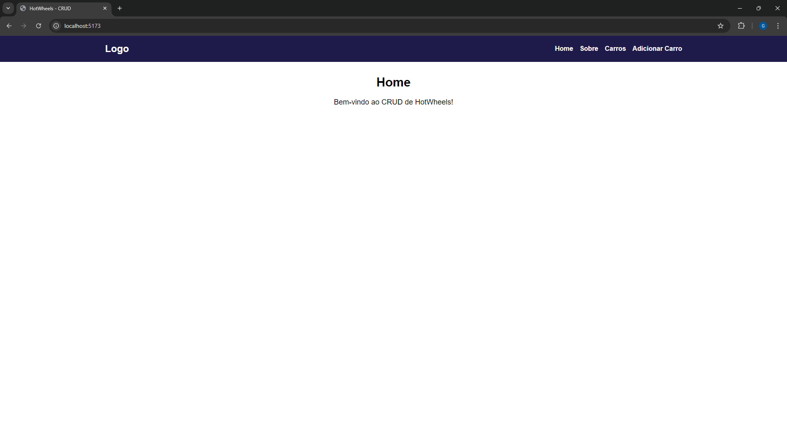

## Nome: `George Lucas Santos Tonietti`

Para executar este projeto:

1. Entre pasta `hotwheels-crud` no terminal:
```
cd hotwheels-crud
```

2. Rode npm install para instalar as dependências do projeto:

```
npm install
```

3. E em seguida, npm start, para iniciar a execução do projeto.

```
npm start
```

Após execução do projeto, este é o resultado esperado no navegador:


## Descrição do projeto

Este projeto contém uma estrutura básica a partir do template Vite, com o objetivo de demostrar funcionalidades dinâmicas através de uma estrutura CRUD. Este projeto é apenas para fins demonstrativos e não contém mais alterações do que as necessárias para demostrar algumas funcionalidades úteis para o desenvolvimento de projetos em ReactJS.

## Componentes

### **CarCard**

- **Descrição**: O `CarCard` exibe informações detalhadas sobre um carro, incluindo marca, nome, cor, ano e preço. Permite a remoção e edição do carro por meio de botões interativos.
- **Conexão com API**: Não se conecta diretamente à API; usa funções passadas como props para manipulação.
- **Propriedades**:
  - `car`: Objeto do tipo `Car` com informações sobre o carro.
  - `remove`: Função para remover o carro (passa o `id` do carro como argumento).
  - `edit`: Função para editar o carro.

### **CreateCarModal**

- **Descrição**: O `CreateCarModal` é um modal para criação de novos carros. Inclui um formulário com validação para garantir que os dados inseridos atendam aos critérios especificados.
- **Conexão com API**: Não se conecta diretamente à API; utiliza a função `createCar` passada como prop para adicionar um carro.
- **Propriedades**:
  - `isOpen`: Booleano que controla se o modal está aberto ou fechado.
  - `onClose`: Função chamada para fechar o modal.
  - `createCar`: Função para criar um carro (passa o objeto `Car` como argumento).

### **EditCarModal**

- **Descrição**: O `EditCarModal` é um modal para editar informações de um carro existente. Inclui um formulário pré-preenchido com os dados do carro e validação para garantir que os dados atendam aos critérios especificados.
- **Conexão com API**: Não se conecta diretamente à API; utiliza a função `editCar` passada como prop para atualizar o carro.
- **Propriedades**:
  - `isOpen`: Booleano que controla se o modal está aberto ou fechado.
  - `onClose`: Função chamada para fechar o modal.
  - `editCar`: Função para editar um carro (passa o objeto `Car` atualizado como argumento).
  - `car`: Objeto do tipo `Car` com informações do carro a ser editado.

### **CarList**

- **Descrição**: O `CarList` exibe uma lista de carros utilizando o `CarCard` para renderizar cada item da lista. Permite visualizar e interagir com informações de múltiplos carros.
- **Conexão com API**: Conecta-se à API para editar e remover carros. As funções de edição e remoção dos carros são realizadas através de chamadas API.
- **Propriedades**:
  - `cars`: Lista de objetos `Car` a serem exibidos.
  - `remove`: Função para remover um carro da lista.
  - `edit`: Função para editar um carro da lista.

### **Cars**

- **Descrição**: O `Cars` serve como um wrapper para o `CarList`. Pode incluir lógica adicional para buscar e gerenciar a lista de carros, bem como manipular estados relacionados à exibição de `CarList` e modais de edição/criação.
- **Conexão com API**: Pode se conectar à API para buscar e manipular dados dos carros (dependendo da implementação específica).

### **CarsSearch**

- **Descrição**: O `CarsSearch` é um componente de formulário para pesquisar carros. Ele utiliza o `react-hook-form` para gerenciar o estado do formulário e `zod` para validação. O formulário atualiza os parâmetros de pesquisa na URL quando o usuário submete a pesquisa.
- **Conexão com API**: Não se conecta diretamente à API; atualiza os parâmetros de pesquisa na URL, que podem ser utilizados por outros componentes para buscar dados.
- **Propriedades**:
  - **Nenhuma propriedade específica**: O componente usa `useSearchParams` do `react-router-dom` para manipular os parâmetros da URL e `react-hook-form` para gerenciar o formulário de pesquisa.

## Testes Automatizados

O projeto utiliza testes automatizados com o framework [React Testing Library](https://testing-library.com/docs/react-testing-library/intro) e o [Jest](https://jestjs.io/). Abaixo estão as instruções para rodar os testes de unidade.

### Como rodar os testes

1. **Instale as dependências**: Caso ainda não tenha instalado as dependências do projeto, use o comando abaixo:
   
   ```bash
   npm install
   ```

2. **Realizando os testes**: Rode os testes com o comando abaixo:

 ```bash
   npm run test
   ```

